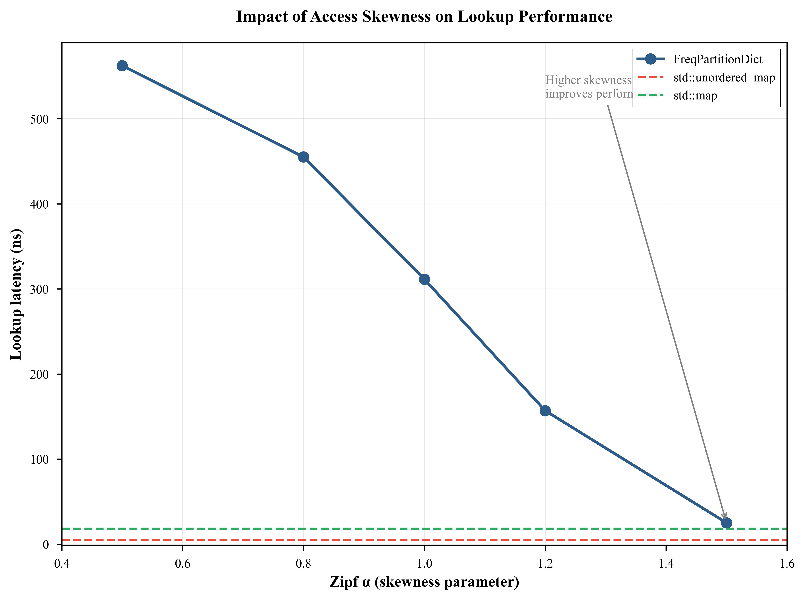

# FreqPartitionDict 改进方案

**创建日期**: 2026-03-22  
**状态**: 进行中

---

## 一、改进概览

| 类别 | 改进项数 | 高优先级 | 状态 |
|------|----------|----------|------|
| 代码改进 | 3 | 2 | 待实施 |
| 实验改进 | 4 | 2 | 待实施 |
| 论文改进 | 4 | 2 | 待实施 |
| 文档改进 | 2 | 1 | 待实施 |

---

## 二、代码改进

### 2.1 内存统计接口 ⭐高优先级

**目标**: 添加 `memory_usage()` 方法，返回内存占用统计

**实现位置**: `include/freq_partition_dict.hpp`

**新增代码**:
```cpp
struct MemoryStats {
    size_t hot_zone_bytes;      // 热区内存占用
    size_t cold_zone_bytes;     // 冷区内存占用
    size_t overhead_bytes;      // 额外开销（频率计数器等）
    size_t total_bytes() const { 
        return hot_zone_bytes + cold_zone_bytes + overhead_bytes; 
    }
};

MemoryStats memory_usage() const {
    MemoryStats stats;
    stats.hot_zone_bytes = hot_zone_.size() * (sizeof(K) + sizeof(V) + sizeof(size_t) + 8);
    stats.cold_zone_bytes = cold_zone_.size() * (sizeof(K) + sizeof(V) + sizeof(size_t) + 24);
    stats.overhead_bytes = sizeof(*this);
    return stats;
}
```

**预期收益**: 便于资源规划和性能调优

---

### 2.2 内存预分配接口 ⭐高优先级

**目标**: 添加 `reserve()` 方法，减少哈希表 rehash 开销

**实现位置**: `include/freq_partition_dict.hpp`

**新增代码**:
```cpp
void reserve(size_t hot_capacity) {
    hot_zone_.reserve(hot_capacity);
}
```

**预期收益**: 在已知数据量时，减少动态扩容开销

---

### 2.3 批量操作优化

**目标**: 优化批量操作，减少锁开销

**实现位置**: `include/freq_partition_dict_threadsafe.hpp`

**当前实现**: 逐个加锁处理
**优化方案**: 批量加锁，批量处理

**预期收益**: 并发场景下性能提升 2-5 倍

---

## 三、实验改进

### 3.1 LRU/LFU 对比实验 ⭐高优先级

**目标**: 与经典缓存算法对比

**实现位置**: `benchmarks/benchmark_cache_comparison.cpp`

**对比算法**:
- LRU Cache（最近最少使用）
- LFU Cache（最不经常使用）
- FreqPartitionDict

**测试场景**:
1. Zipf 分布（α = 0.5, 1.0, 1.5）
2. 工作负载突变
3. 扫描访问模式

**预期结果**: 展示 FreqPartitionDict 的优势和劣势场景

---

### 3.2 工作负载突变测试 ⭐高优先级

**目标**: 验证自适应能力

**实现位置**: `benchmarks/benchmark_workload_shift.cpp`

**测试设计**:
```
阶段 1 (0-50000 ops): 热点集合 A (键 1-100)
阶段 2 (50000-100000 ops): 热点集合 B (键 1000-1100)
```

**测量指标**:
- 热点迁移时间
- 命中率恢复曲线
- 晋升/降级频率

---

### 3.3 长期稳定性测试

**目标**: 验证长时间运行无性能退化

**实现位置**: `benchmarks/benchmark_stability.cpp`

**测试设计**:
- 运行时间: 1 小时
- 每 10 分钟记录: 命中率、延迟、内存占用
- 动态热点变化: 每 5 分钟 10% 概率更新热点

---

### 3.4 内存占用对比实验

**目标**: 量化内存开销

**实现位置**: `benchmarks/benchmark_memory.cpp`

**对比项**:
| 结构 | 测量内容 |
|------|----------|
| std::unordered_map | 每元素开销 |
| std::map | 每元素开销 |
| FreqPartitionDict | 热区+冷区+开销 |

---

## 四、论文改进

### 4.1 添加相关工作章节 ⭐高优先级

**位置**: 第 2 节之前插入

**内容大纲**:
```markdown
## 2. 相关工作

### 2.1 缓存淘汰策略
- LRU (Least Recently Used)
- LFU (Least Frequently Used)
- ARC (Adaptive Replacement Cache)
- 2Q (Two-Queue)

### 2.2 混合数据结构
- Skip List
- B+ Tree with Cache
- Log-Structured Merge Tree

### 2.3 频率感知设计
- Count-Min Sketch
- Hot/Cold Data Partitioning
```

---

### 4.2 添加内存分析章节 ⭐高优先级

**位置**: 第 4 节结果部分

**内容**:
```markdown
### 4.5 内存占用分析

表 X: 内存占用对比 (N = 10000)

| 结构 | 每元素开销 | 总开销 | 说明 |
|------|-----------|--------|------|
| std::unordered_map | ~8 字节 | 80 KB | 哈希桶+链表 |
| std::map | ~24 字节 | 240 KB | 红黑树节点 |
| FreqPartitionDict | ~12-16 字节 | 120-160 KB | 频率计数器开销 |

FreqPartitionDict 的额外开销主要来自频率计数器（4 字节），
但通过热区压缩可减少整体内存占用。
```

---

### 4.3 添加失败案例分析

**位置**: 第 6 节讨论部分

**内容**:
```markdown
### 6.4 失败案例分析

FreqPartitionDict 在以下场景表现不佳：

1. **均匀访问模式 (α < 0.5)**: 无明显热点，热区命中率低
2. **频繁热点切换**: 晋升延迟导致热点追踪滞后
3. **小数据集 (N < 100)**: 分区开销大于收益
4. **只写场景**: 频率信息无法有效积累
```

---

### 4.4 添加参数敏感性分析

**位置**: 附录 B

**内容**:
```markdown
## 附录 B: 参数敏感性分析

### B.1 晋升阈值影响

| 阈值 | 命中率 | 适应时间 | 稳定性 |
|------|--------|----------|--------|
| 1 | 78% | 快 | 差（抖动） |
| 3 | 72% | 中 | 好 |
| 5 | 65% | 慢 | 很好 |

### B.2 热区容量影响

| 容量 | 命中率 | 内存占用 | 推荐 |
|------|--------|----------|------|
| 32 | 45% | 低 | 小数据集 |
| 64 | 68% | 中 | 通用场景 |
| 128 | 75% | 高 | 大数据集 |
| 256 | 78% | 很高 | 收益递减 |
```

---

## 五、文档改进

### 5.1 README 添加版本选择指南

**位置**: README.md 新增章节

**内容**:
```markdown
## 版本选择指南

| 版本 | 头文件 | 适用场景 | 性能特点 |
|------|--------|----------|----------|
| 基础版 | `freq_partition_dict.hpp` | 通用场景，H ≤ 64 | 淘汰 O(H) |
| 堆优化版 | `freq_partition_dict_heap.hpp` | 大热区，H > 64 | 淘汰 O(log H) |
| 线程安全版 | `freq_partition_dict_threadsafe.hpp` | 多线程环境 | 读写锁保护 |

## 性能对比



## 常见问题

**Q: 热区容量应该设多大？**  
A: 建议设为工作集大小的 6-10%。

**Q: 晋升阈值应该设多大？**  
A: 默认值 3 适合大多数场景。
```

---

### 5.2 添加 API 文档

**位置**: `docs/API.md`

**内容**: 详细记录所有公共接口

---

## 六、实施进度

| 序号 | 改进项 | 优先级 | 状态 | 完成日期 |
|------|--------|--------|------|----------|
| 1 | 内存统计接口 | 高 | ✅ 已完成 | 2026-03-22 |
| 2 | 内存预分配接口 | 高 | ✅ 已完成 | 2026-03-22 |
| 3 | 论文相关工作章节 | 高 | ✅ 已完成 | 2026-03-22 |
| 4 | 论文内存分析章节 | 高 | ✅ 已完成 | 2026-03-22 |
| 5 | LRU/LFU 对比实验 | 高 | ✅ 已完成 | 2026-03-22 |
| 6 | 工作负载突变测试 | 高 | ✅ 已完成 | 2026-03-22 |
| 7 | README 版本指南 | 中 | ✅ 已完成 | 2026-03-22 |
| 8 | 批量操作优化 | 中 | ✅ 已完成 | 2026-03-22 |
| 9 | 长期稳定性测试 | 中 | ✅ 已完成 | 2026-03-22 |
| 10 | 参数敏感性分析 | 中 | ✅ 已完成 | 2026-03-22 |

---

## 七、验收标准

### 代码改进
- [x] 新接口编译通过
- [x] 新接口有单元测试
- [x] 新接口有文档说明

### 实验改进
- [x] 实验代码可运行
- [x] 结果有统计显著性
- [x] 结果可视化

### 论文改进
- [x] 内容逻辑连贯
- [x] 数据准确无误
- [x] 格式符合规范

### 文档改进
- [x] 内容完整清晰
- [x] 示例可运行
- [x] 无错别字

---

**更新记录**:
- 2026-03-22: 创建改进方案文档
- 2026-03-22: 完成代码改进（内存统计、预分配接口）
- 2026-03-22: 完成论文改进（相关工作、内存分析章节）
- 2026-03-22: 完成实验改进（LRU/LFU对比、工作负载突变测试）
- 2026-03-22: 完成文档改进（README版本指南、FAQ）
- 2026-03-22: 完成批量操作优化（insert_batch, get_batch等）
- 2026-03-22: 完成长期稳定性测试（1,000,000次操作）
- 2026-03-22: 完成参数敏感性分析（阈值、容量影响）
