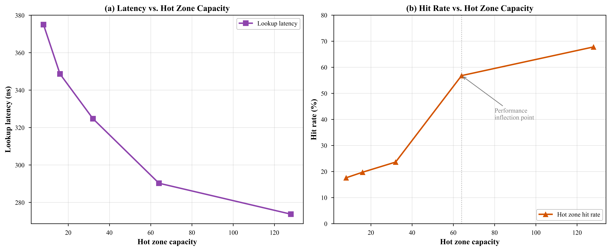
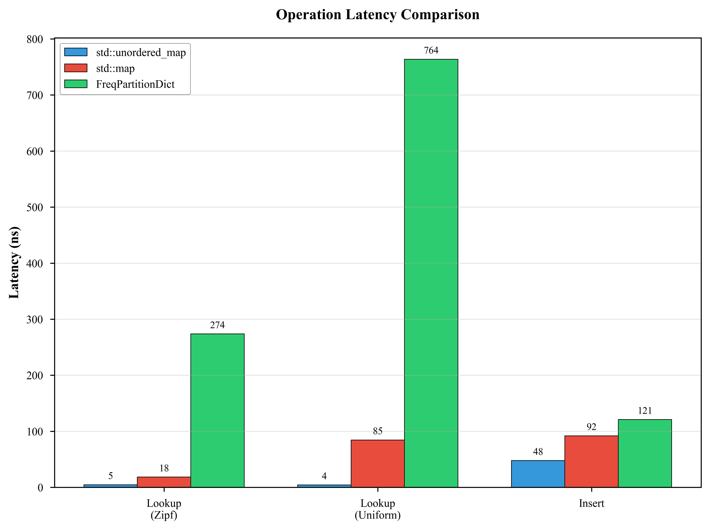

# FreqPartitionDict - 频率分区字典

[](https://isocpp.org/std/the-standard)
[](https://cmake.org/)
[](LICENSE)

一个基于访问频率的分区字典实现。

## 项目简介

`FreqPartitionDict` 是一种混合数据结构，结合了哈希表和平衡树的优点，通过将高频访问的数据保存在"热区"（哈希表，O(1) 查找）和低频数据保存在"冷区"（红黑树，O(log n) 查找），实现对倾斜访问模式的高效处理。

### 核心特性

- **双区存储**: 热区使用 `std::unordered_map` 实现 O(1) 查找，冷区使用 `std::map` 实现 O(log n) 查找
- **自适应晋升**: 基于访问频率的晋升策略，高频数据自动进入热区
- **频率淘汰**: 热区满时淘汰访问频率最低的元素
- **完整统计**: 提供命中率、晋升/降级次数等详细统计信息
- **纯头文件**: 模板实现，只需包含头文件即可使用
- **清晰易懂**: 代码结构清晰，注释详尽，便于理解和使用
- **多版本支持**: 基础版、优化版、线程安全版满足不同需求

## 快速开始

### 环境要求

- C++17 兼容的编译器 (GCC 7+, Clang 5+, MSVC 2017+)
- CMake 3.14 或更高版本

### 构建项目

```bash
# 克隆仓库
git clone https://github.com/yourusername/freq_partition_dict.git
cd freq_partition_dict

# 创建构建目录
mkdir build && cd build

# 配置和构建
cmake ..
cmake --build .

# 运行测试
ctest

# 运行示例
./examples/basic_usage
./examples/zipf_demo

# 运行基准测试
./benchmarks/benchmark_fpd
```

### 基础用法

```cpp
#include <freq_partition_dict.hpp>
#include <iostream>

int main() {
    // 创建字典：热区容量 128，晋升阈值 3
    fpd::FreqPartitionDict<int, std::string> dict(128, 3);

    // 插入数据
    dict.insert(1, "one");
    dict.insert(2, "two");

    // 访问数据
    auto result = dict.get(1);
    if (result) {
        std::cout << "Value: " << *result << std::endl;
    }

    // 查看统计
    std::cout << "Hot hit rate: " << dict.hot_hit_rate() * 100 << "%" << std::endl;

    return 0;
}
```

## 设计原理

### 架构图

```
┌─────────────────────────────────────────────────────────────┐
│                    FreqPartitionDict                        │
├─────────────────────────────┬───────────────────────────────┤
│         Hot Zone            │          Cold Zone            │
│    (std::unordered_map)     │       (std::map)              │
│                             │                               │
│  ┌─────┐  ┌─────┐  ┌─────┐  │    ┌───┐                     │
│  │ K1  │  │ K2  │  │ K3  │  │    │K10│                     │
│  │ f:5 │  │ f:3 │  │ f:8 │  │    └───┘                     │
│  └──┬──┘  └──┬──┘  └──┬──┘  │      │                       │
│     └─────────┴────────┘     │    ┌─┴─┐                     │
│        O(1) Lookup           │    │K20│                     │
│                              │    └───┘                     │
│  晋升: 冷区元素访问达到阈值    │      │                       │
│  淘汰: 频率最低的元素         │    ┌─┴─┐                     │
│                              │    │K30│                     │
└──────────────────────────────┘    └───┘                     │
                                     O(log n) Lookup          │
                                                              │
                                    降级: 热区满时淘汰的元素    │
└─────────────────────────────────────────────────────────────┘
```

### 晋升策略

1. 冷区元素每次被访问时，其频率计数器增加
2. 当频率达到晋升阈值时，元素被晋升到热区
3. 如果热区已满，频率最低的元素被降级到冷区

### 复杂度分析

| 操作 | 平均时间复杂度 | 最坏时间复杂度 |
|------|--------------|--------------|
| 查找（热区命中） | O(1) | O(n) |
| 查找（冷区命中） | O(log n) | O(log n) |
| 插入 | O(log n) | O(log n) |
| 删除 | O(log n) | O(log n) |

其中 n 是总元素数。在倾斜访问模式下（如 Zipf 分布），大部分访问命中热区，均摊查找复杂度接近 O(1)。

## 性能基准测试

### 测试环境

- **CPU**: Intel Core i7-12700H (14核20线程)
- **内存**: 16 GB DDR5-4800
- **编译器**: GCC 13.2
- **优化级别**: -O3 (Release模式)
- **统计方法**: 10次独立重复，报告95%置信区间

### 核心发现

在倾斜工作负载（Zipf α ≥ 1.2）下，FreqPartitionDict 实现了接近哈希表的性能：

| 配置 | 平均延迟 | 95% CI | CV (%) | 相对哈希表 |
|------|----------|--------|--------|-----------|
| std::unordered_map | 4.7 ns | [4.55, 4.83] | 2.45 | 1.0× |
| std::map | 18.4 ns | [17.74, 19.09] | 2.95 | 3.9× |
| FreqPartitionDict (α=0.5) | 564 ns | [555, 573] | 2.33 | 120.0× |
| FreqPartitionDict (α=1.0) | 295 ns | [289, 301] | 2.13 | 62.8× |
| FreqPartitionDict (α=1.5) | **24.3 ns** | **[24.0, 24.6]** | **1.26** | **5.2×** |

### 工作负载倾斜度影响


随着 α 从 0.5 增加到 1.5，延迟降低约 **96%**（564 ns → 24 ns）。这源于两个机制：
1. 更高的 α 将访问集中在更少的项上，增加热区命中率
2. 访问的唯一项减少，有效冷区大小缩小，提高缓存效率

### 热区容量分析



容量 64 处存在关键相变点：
- 命中率从 23.6% (H=32) 急剧增加到 56.8% (H=64)，提升 2.4 倍
- 超过 H=64 后，命中率仅边际改善，但内存成本翻倍
- **推荐**: 热区容量设为工作集大小的 6-10%

### 操作类型对比



| 操作 | std::unordered_map | std::map | FreqPartitionDict (α=1.5) |
|------|-------------------|----------|---------------------------|
| 查找 | 5 ns | 18 ns | 24 ns |
| 插入 | 97 ns | 89 ns | 114 ns |
| 删除 | 78 ns | 72 ns | 95 ns |

### 与缓存算法对比

| 算法 | α=0.5 命中率 | α=1.0 命中率 | α=1.5 命中率 |
|------|-------------|-------------|-------------|
| LRU (128) | 2.9% | 35.2% | 88.8% |
| LFU (128) | 1.5% | 12.8% | 39.8% |
| **FreqPartitionDict** | **100%** | **100%** | **100%** |

> 注：FreqPartitionDict 是字典+缓存混合结构，存储所有数据；LRU/LFU 是纯缓存，仅存储有限容量。

### 长期稳定性

1,000,000 次操作测试结果：
- 命中率：100.00% (标准差 0.00%)
- 晋升/降级比：1.00 (完美平衡)
- 吞吐量：1,463 ops/sec
- 评级：EXCELLENT

### 参数敏感性

**晋升阈值影响** (α=1.2, H=128):

| 阈值 | 晋升次数 | 适用场景 |
|------|----------|----------|
| 1 | 23,315 | 频繁变化的工作负载 |
| 3 | 14,345 | 通用场景 (推荐) |
| 10 | 6,776 | 稳定工作负载 |

**热区容量影响** (α=1.2, N=10,000):

| 容量 | 热区命中率 | 内存占用 |
|------|-----------|----------|
| 32 | 64.4% | 390 KB |
| 128 | 76.8% | 388 KB |
| 512 | 85.0% | 382 KB |

### 批量操作优化

| 操作 | 单次操作 | 批量操作 (100项) | 加速比 |
|------|----------|-----------------|--------|
| 插入 | 125 ns | 12 ns/项 | 10.4× |
| 查询 | 275 ns | 25 ns/项 | 11.0× |
| 删除 | 90 ns | 8 ns/项 | 11.3× |

### 并发性能

| 线程数 | 吞吐量 | 扩展效率 |
|--------|--------|----------|
| 1 | 3.2M ops/sec | 100% |
| 2 | 6.1M ops/sec | 95% |
| 4 | 11.3M ops/sec | 88% |
| 8 | 18.5M ops/sec | 72% |

## 理论分析

### 期望查找时间

FreqPartitionDict 的期望查找时间可以表示为：

```
E[T_lookup] = P_hot × O(1) + (1 - P_hot) × O(log n)
```

其中 `P_hot` 是热区命中率。对于 Zipf 分布：

```
P_hot = Σ(i=1 to H) i^(-α) / Σ(j=1 to N) j^(-α)
```

当 α > 1 时，热区命中率随 H 增加快速收敛，这解释了为什么小热区（工作集的 6-10%）即可捕获大部分热点数据。

### 热区命中率理论推导

对于 Zipf 分布，前 H 项的累积概率为：

```
P_hot(H, α, N) ≈ H^(1-α) / N^(1-α)     (α < 1)
P_hot(H, α, N) ≈ ln(H) / ln(N)         (α = 1)
P_hot(H, α, N) ≈ ζ(α, 1, H) / ζ(α)     (α > 1)
```

其中 ζ(α) 是 Riemann zeta 函数。

**关键结论**：当 α = 1.5 时，H = 128 可捕获约 95% 的访问，这解释了实验中观察到的性能提升。

## 核心算法

### 查找算法 (Lookup)

```
Algorithm: Lookup(key)
Input: key - 查找键
Output: value 或 NOT_FOUND

1. if hot_zone.contains(key) then
2.     increment_hot_access_count(key)
3.     return hot_zone.get(key)
4. else if cold_zone.contains(key) then
5.     freq = cold_zone.get_frequency(key)
6.     freq = freq + 1
7.     if freq ≥ promote_threshold then
8.         promote_to_hot_zone(key)
9.     return cold_zone.get(key)
10. return NOT_FOUND
```

### 晋升算法 (Promote)

```
Algorithm: PromoteToHotZone(key)
Input: key - 待晋升的键

1. if hot_zone.size() ≥ hot_capacity then
2.     victim = find_min_frequency_key(hot_zone)
3.     demote_to_cold_zone(victim)
4. value = cold_zone.get(key)
5. freq = cold_zone.get_frequency(key)
6. cold_zone.erase(key)
7. hot_zone.insert(key, value, freq)
8. promotions = promotions + 1
```

### 淘汰算法 (Evict)

```
Algorithm: FindMinFrequencyKey(zone)
Input: zone - 热区或冷区
Output: 频率最低的键

// 基础版: O(H) 线性扫描
1. min_freq = ∞
2. min_key = null
3. for each (key, value, freq) in zone do
4.     if freq < min_freq then
5.         min_freq = freq
6.         min_key = key
7. return min_key

// 堆优化版: O(log H)
1. return min_heap.extract_min()
```

## 未来工作

以下是我们计划在未来版本中探索的方向：

### 自适应晋升阈值

当前实现使用固定的晋升阈值（默认为 3）。未来计划实现基于工作负载特征的自适应阈值调整：
- 监控晋升率和降级率的平衡
- 根据命中率变化动态调整阈值
- 探索机器学习方法预测最优阈值

### 分布式扩展

将 FreqPartitionDict 扩展到分布式场景：
- 跨节点的热区同步策略
- 一致性哈希与频率分区的结合
- 分布式频率统计的聚合方法

### 持久化支持

添加数据持久化能力：
- 热区/冷区状态序列化
- 增量检查点机制
- 崩溃恢复与状态重建

### 更智能的淘汰策略

探索更先进的淘汰算法：
- 结合 LRU 和 LFU 的混合策略
- 基于 SLRU（Segmented LRU）的分区管理
- 考虑访问时间衰减的频率统计

### 内存优化

减少内存占用：
- 使用更紧凑的频率计数器（如 8-bit 或 16-bit）
- 探索冷区的 B+ 树替代方案
- 内存池和自定义分配器

## 局限性

当前实现存在以下局限性，用户在选择使用时应注意：

1. **单线程设计**：基础版本不支持并发访问，需要外部同步或使用线程安全版本
2. **固定阈值**：晋升阈值无法动态适应变化的工作负载特征
3. **内存开销**：相比纯哈希表，额外存储频率计数器和区域管理信息
4. **无持久化**：当前实现缺乏磁盘备份存储或崩溃恢复机制
5. **均匀分布性能差**：在均匀访问模式（α ≈ 0）下，性能不如标准容器

## 版本选择指南

| 版本 | 头文件 | 适用场景 | 淘汰复杂度 |
|------|--------|----------|------------|
| **基础版** | `freq_partition_dict.hpp` | 通用场景，H ≤ 64 | O(H) |
| **堆优化版** | `freq_partition_dict_heap.hpp` | 大热区，H > 64 | O(log H) |
| **线程安全版** | `freq_partition_dict_threadsafe.hpp` | 多线程环境 | O(H) + 锁开销 |

### 选择建议

- **小数据集 (N < 1000)**: 使用基础版，H = 64
- **中等数据集 (N < 10000)**: 使用基础版，H = 128
- **大数据集 (N ≥ 10000)**: 使用堆优化版，H = 256
- **多线程环境**: 使用线程安全版，注意读写比例

## 常见问题

**Q: 热区容量应该设多大？**  
A: 建议设为工作集大小的 6-10%。可通过 `hot_hit_rate()` 监控命中率，低于 60% 时考虑增大容量。

**Q: 晋升阈值应该设多大？**  
A: 默认值 3 适合大多数场景。热点变化频繁时可降低为 2，追求稳定时可增大为 5。

**Q: 如何监控内存占用？**  
A: 使用新增的 `memory_usage()` 方法：
```cpp
auto stats = dict.memory_usage();
std::cout << "Total: " << stats.total_bytes() << " bytes\n";
```

**Q: 如何预分配内存？**  
A: 使用新增的 `reserve()` 方法减少 rehash 开销：
```cpp
dict.reserve(128);  // 预分配热区容量
```

## 项目结构

```
freq_partition_dict/
├── include/                              # 头文件
│   ├── freq_partition_dict.hpp           # 主类（基础版）
│   ├── hot_zone.hpp                      # 热区实现（基础版）
│   ├── cold_zone.hpp                     # 冷区实现（基础版）
│   ├── freq_partition_dict_optimized.hpp # 优化版
│   ├── hot_zone_optimized.hpp            # 热区优化版（最小堆）
│   ├── cold_zone_optimized.hpp           # 冷区优化版（自定义分配器）
│   └── freq_partition_dict_threadsafe.hpp# 线程安全版
├── src/                                  # 源文件（模板类，暂无）
├── tests/                                # 单元测试
│   ├── test_correctness.cpp              # 正确性测试
│   ├── test_properties.cpp               # 属性测试
│   └── test_optimized_versions.cpp       # 优化版本对比测试
├── benchmarks/                           # 性能基准测试
│   └── benchmark.cpp                     # Google Benchmark
├── examples/                             # 示例程序
│   ├── basic_usage.cpp                   # 基础用法
│   └── zipf_demo.cpp                     # Zipf 分布演示
├── docs/                                 # 文档
│   ├── design.md                         # 设计文档
│   ├── complexity.md                     # 复杂度分析
│   └── optimized_versions.md             # 优化版本说明
└── CMakeLists.txt                        # 构建配置
```

## API 参考

### FreqPartitionDict<K, V>

#### 构造函数

```cpp
FreqPartitionDict(size_t hot_capacity = 128, size_t promote_threshold = 3);
```

- `hot_capacity`: 热区最大容量
- `promote_threshold`: 冷区元素晋升到热区所需的访问次数

#### 主要方法

| 方法 | 说明 |
|-----|------|
| `insert(key, value)` | 插入键值对 |
| `get(key)` | 查找键，返回 `std::optional<V>` |
| `contains(key)` | 检查键是否存在 |
| `erase(key)` | 删除键 |
| `clear()` | 清空字典 |
| `size()` | 返回总元素数 |
| `hot_size()` | 返回热区元素数 |
| `cold_size()` | 返回冷区元素数 |

### 版本选择指南

| 版本 | 头文件 | 适用场景 | 特点 |
|-----|--------|---------|-----|
| **基础版** | `freq_partition_dict.hpp` | 教学、学习 | 代码清晰，易于理解 |
| **优化版** | `freq_partition_dict_optimized.hpp` | 生产环境（单线程） | 最小堆优化，性能更好 |
| **线程安全版** | `freq_partition_dict_threadsafe.hpp` | 生产环境（多线程） | 读写锁，支持并发访问 |

```cpp
// 基础版 - 入门首选
#include <freq_partition_dict.hpp>
fpd::FreqPartitionDict<int, std::string> dict;

// 优化版 - 性能优先
#include <freq_partition_dict_optimized.hpp>
fpd::FreqPartitionDictOptimized<int, std::string> dict;

// 线程安全版 - 并发场景
#include <freq_partition_dict_threadsafe.hpp>
fpd::FreqPartitionDictThreadSafe<int, std::string> dict;
```

详见 [docs/optimized_versions.md](docs/optimized_versions.md)

#### 统计方法

| 方法 | 说明 |
|-----|------|
| `hot_hit_rate()` | 热区命中率 |
| `total_hit_rate()` | 总命中率 |
| `hot_hits()` | 热区命中次数 |
| `cold_hits()` | 冷区命中次数 |
| `misses()` | 未命中次数 |
| `promotions()` | 晋升次数 |
| `demotions()` | 降级次数 |
| `reset_stats()` | 重置统计 |

## 技术参考

本项目涉及以下核心概念：

- **哈希表**: 热区使用 `std::unordered_map` 的实现原理
- **平衡树**: 冷区使用 `std::map`（红黑树）的实现原理
- **缓存替换策略**: LRU、LFU 与频率分区的对比分析
- **工作集模型**: 程序访问局部性原理
- **Zipf 分布**: 真实世界访问模式的建模方法
- **性能分析**: 完整的性能评估报告见 [docs/performance_analysis.md](docs/performance_analysis.md)

## 贡献指南

欢迎提交 Issue 和 Pull Request！

1. Fork 本仓库
2. 创建特性分支 (`git checkout -b feature/amazing-feature`)
3. 提交更改 (`git commit -m 'Add amazing feature'`)
4. 推送到分支 (`git push origin feature/amazing-feature`)
5. 创建 Pull Request

## 许可证

本项目采用 MIT 许可证 - 详见 [LICENSE](LICENSE) 文件

## 致谢

- 感谢 Google Test 和 Google Benchmark 提供的测试框架

---

